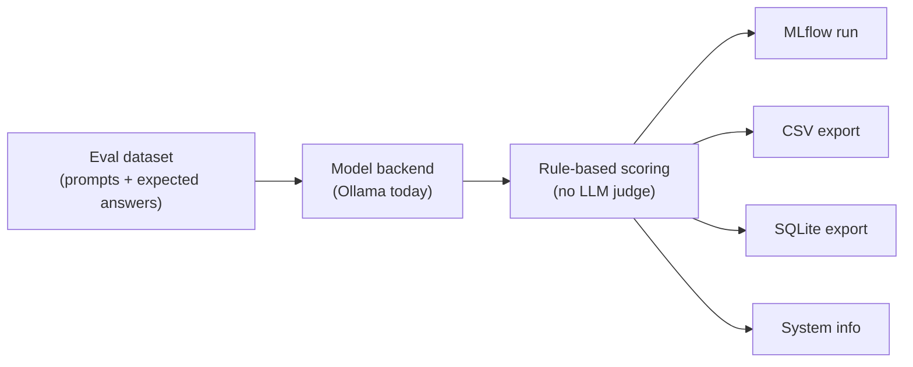

# llm-evaluation

A small local LLM evaluation harness for models served by [Ollama](https://ollama.com),
scored with rule-based/code checkers (no LLM-as-judge) and tracked in
[MLflow](https://mlflow.org), with a flat CSV/SQLite export for your own analysis.

## Requirements

- [Ollama](https://ollama.com) running locally (`http://localhost:11434`) with at least
  one model pulled (`ollama pull <model>`)
- [uv](https://docs.astral.sh/uv/) for dependency management

## Setup

```bash
uv sync
```

## Usage

```bash
uv run src/mlflow_eval.py --models ornith:9b llama3.1:8b qwen2.5-coder:7b
```

Then browse results:

```bash
uv run src/mlflow_ui.py
# open http://localhost:5000 and browse the "local-llm-eval" experiment
```

(`mlflow_ui.py` just wraps `mlflow ui --backend-store-uri sqlite:///results/mlflow.db`
— plain `mlflow ui` defaults to a tracking DB at the repo root instead, which this
project doesn't use.)

Everything lands under `./results/` — nothing is written to the repo root:
MLflow's own tracking DB (`mlflow.db`) and artifact store (`mlartifacts/`), plus a
flat CSV, SQLite export, and a system-info snapshot (CPU/GPU/RAM/Ollama version, for
comparing runs across machines).

### Options

| Flag | Default | Description |
|---|---|---|
| `--config` | | Path to a `configs/*.yaml` eval suite (models + categories) — see below |
| `--models` | *(required unless `--config` is given)* | One or more Ollama model tags to evaluate |
| `--experiment` | `local-llm-eval` | MLflow experiment name |
| `--out` | `results` | Output directory for CSV/SQLite export |
| `--all` | | Run every category (default when no category flag is given) |
| `--basic` | | Run only `basic_questions` |
| `--tools` | | Run only `tool_usage` |
| `--coding` | | Run only `coding` |
| `--finance` | | Run only `finance` |
| `--reasoning` | | Run only `reasoning` |
| `--instructions` | | Run only `instruction_following` |
| `--design` | | Run only `design` |

Category flags are additive, so `--basic --tools` runs both. Omitting all of them
is equivalent to `--all`.

### Named eval-suite configs

Instead of retyping a long `--models ... --basic --tools` invocation, define a
suite once under `configs/*.yaml`:

```yaml
# configs/quick-smoke.yaml
models:
  - lfm2.5:8b
categories:
  - basic_questions
  - tool_usage
```

```yaml
# configs/full-nightly.yaml
models:
  - lfm2.5:8b
  - qwen3.5:9b
  - ornith:9b
categories: all
```

`categories` must be `all` or a list drawn from the same category names used
elsewhere (`basic_questions`, `tool_usage`, `coding`, `finance`, `reasoning`,
`instruction_following`, `design`).

```bash
uv run src/mlflow_eval.py --config configs/quick-smoke.yaml
```

Any `--models` or category flag passed alongside `--config` overrides that
part of the config rather than merging with it — e.g.
`--config configs/quick-smoke.yaml --coding` runs quick-smoke's models against
only the `coding` category.

### Reading the MLflow UI

All models/categories from one script invocation share a single MLflow run (so the
Run ID/name — a short run_id hex string — stays constant instead of changing per
model). To tell results apart:

- **Run list**: each run has `models` and `categories` tags summarizing what that
  invocation covered — enable them via the Columns picker if they're hidden. Each
  entry in `models` is `<tag>:<digest short form>` (e.g. `lfm2.5:8b:9cf756159fc2`)
  so two runs of the "same" model tag can be told apart at a glance if the
  underlying weights were re-pulled between runs.
- **Traces/Evaluation table**: every individual sample is tagged with `model`,
  `category`, and `model_digest` (the full sha256 of the pulled model weights,
  from Ollama's `/api/tags`) — enable those columns to filter/sort/group
  per-model results.

## What's scored, and how

Every category is scored with deterministic, rule-based checkers — no LLM judge. See
`src/datasets/` for the full dataset and `mlflow_eval.py` for the scorer implementations.

| Category | How it's scored |
|---|---|
| `basic_questions` | Exact/substring match against a known-correct short answer |
| `tool_usage` | Structural check: right tool name + required arg keys present (does not validate argument *values*) |
| `coding` | The model's generated code is **actually executed** against test cases in a subprocess — real pass/fail |
| `finance` | Numeric answer extracted from the response and checked against a value computed with plain Python |
| `reasoning` | Same numeric-extraction approach as `finance` — these are riddles with one unambiguous computed answer |
| `instruction_following` | Concrete, machine-verifiable constraints (sentence/bullet counts, word limits, forbidden words, required JSON keys) |
| `design` | **No deterministic scorer exists** for open-ended system design quality. Included for side-by-side manual review only — the attached score is a keyword-coverage checklist, not a quality grade |

Every row also captures timing/throughput metrics pulled directly from Ollama's own
response fields (not estimated): wall-clock latency, decode tokens/sec, prefill
tokens/sec, and a best-effort VRAM delta via `nvidia-smi`.

## Architecture



`Model backend` is Ollama-only today; `Outputs` is currently MLflow + CSV + SQLite +
system info. Both are the spots meant to grow — more backends feeding in, more
export formats fanning out — without changing the dataset or scoring stages.

## Files

- `src/mlflow_eval.py` — main entrypoint: runs the dataset against Ollama, scores
  it, logs to MLflow, exports CSV/SQLite
- `src/datasets/` — the eval cases (prompts, tool schemas, expected
  answers/test cases), one file per category, consumed by `mlflow_eval.py`
- `src/mlflow_ui.py` — launches `mlflow ui` pointed at `results/mlflow.db`
- `configs/` — named eval-suite yaml files consumed via `--config` (see above)
- `tests/` — pytest suite (see Development below)

## Development

Run the test suite (currently covers the `--config`/CLI override logic; no Ollama
or MLflow server needed):

```bash
uv sync --group dev
uv run pytest
```

See [CONTRIBUTING.md](CONTRIBUTING.md) for how to add a new question to an
existing category, or add a new category entirely.
